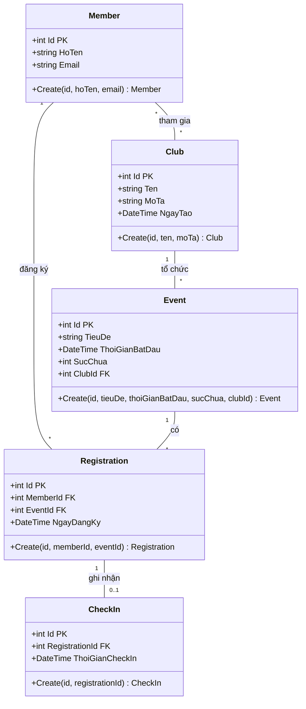

# Sơ đồ lớp - EduHub

```mermaid
classDiagram
    class Member {
        +int Id PK
        +string HoTen
        +string Email
        +Create(id, hoTen, email) Member
    }
    class Club {
        +int Id PK
        +string Ten
        +string MoTa
        +DateTime NgayTao
        +Create(id, ten, moTa) Club
    }
    class Event {
        +int Id PK
        +string TieuDe
        +DateTime ThoiGianBatDau
        +int SucChua
        +int ClubId FK
        +Create(id, tieuDe, thoiGianBatDau, sucChua, clubId) Event
    }
    class Registration {
        +int Id PK
        +int MemberId FK
        +int EventId FK
        +DateTime NgayDangKy
        +Create(id, memberId, eventId) Registration
    }
    class CheckIn {
        +int Id PK
        +int RegistrationId FK
        +DateTime ThoiGianCheckIn
        +Create(id, registrationId) CheckIn
    }

    Member "*" -- "*" Club : tham gia
    Club "1" -- "*" Event : tổ chức
    Member "1" -- "*" Registration : đăng ký
    Event "1" -- "*" Registration : có
    Registration "1" -- "0..1" CheckIn : ghi nhận
```